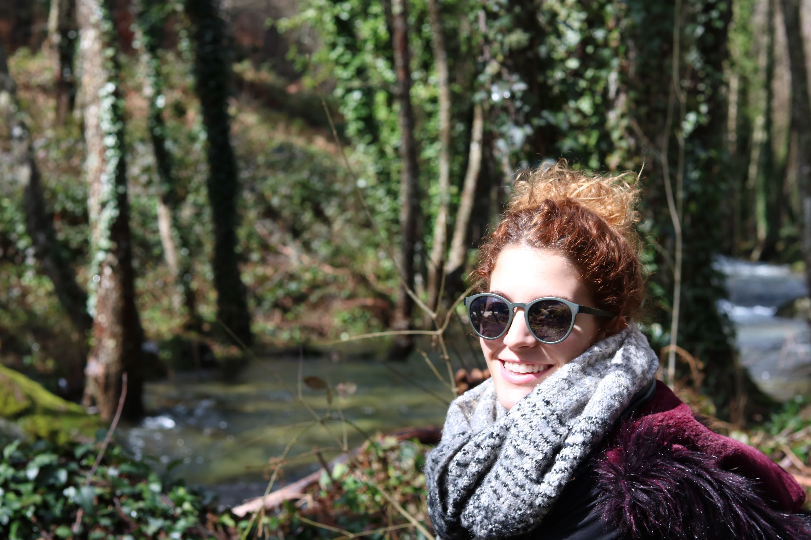
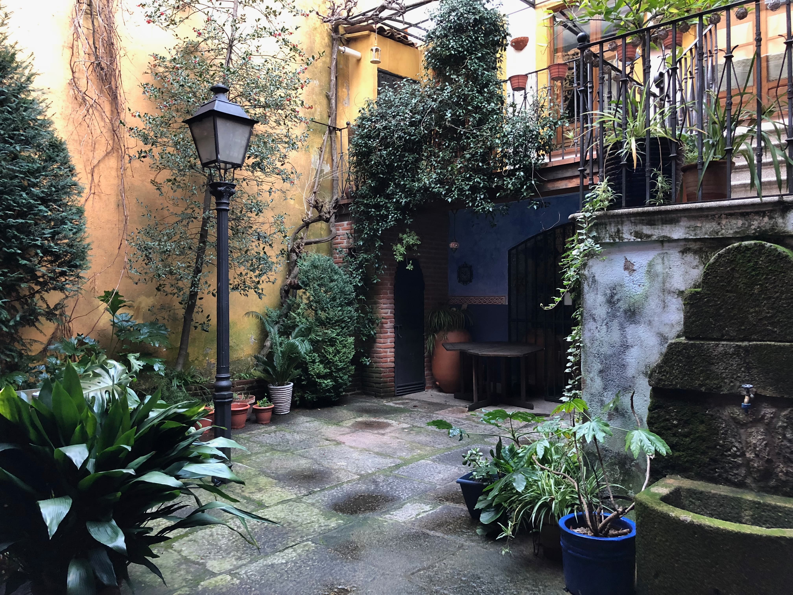
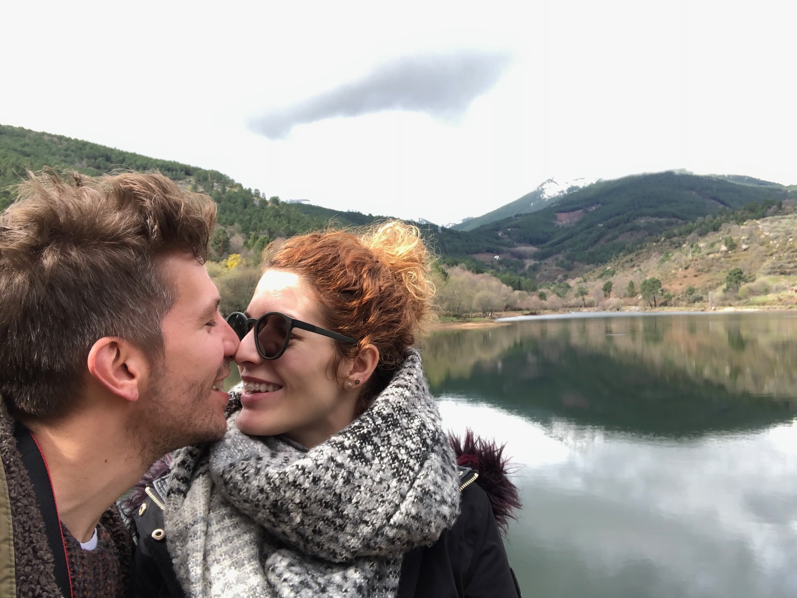
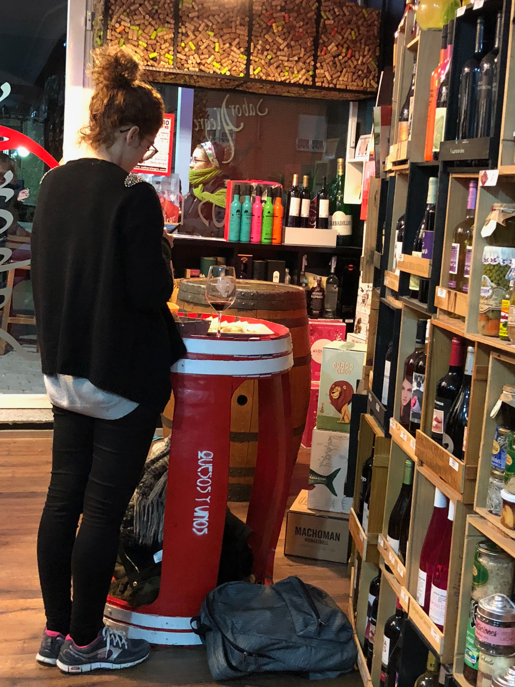

Un viajecito relajante a la montaña. Pajaritos, árboles y el sonido relajante del río. Eran los tiempos en que eras... ¡¡¡¡pelirrojita!!!!!

¿Te acuerdas de que el hotel que buscaste era súper bonito?

Además pudimos dar muchos paseos cerca del lago que había en el hotel y hacernos una de mis fotos favoritas juntos.

¡Y que no falte el quesito! Por la noche fuimos a una bodega a tomar unas tapitas de queso con vino la mar de ricas.

