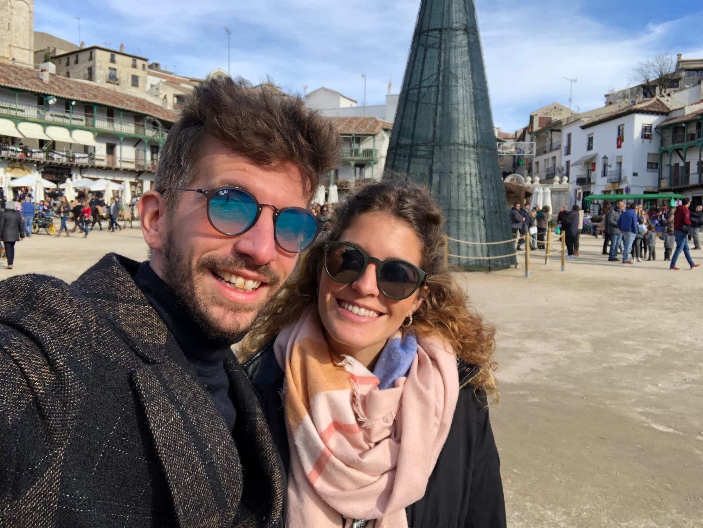
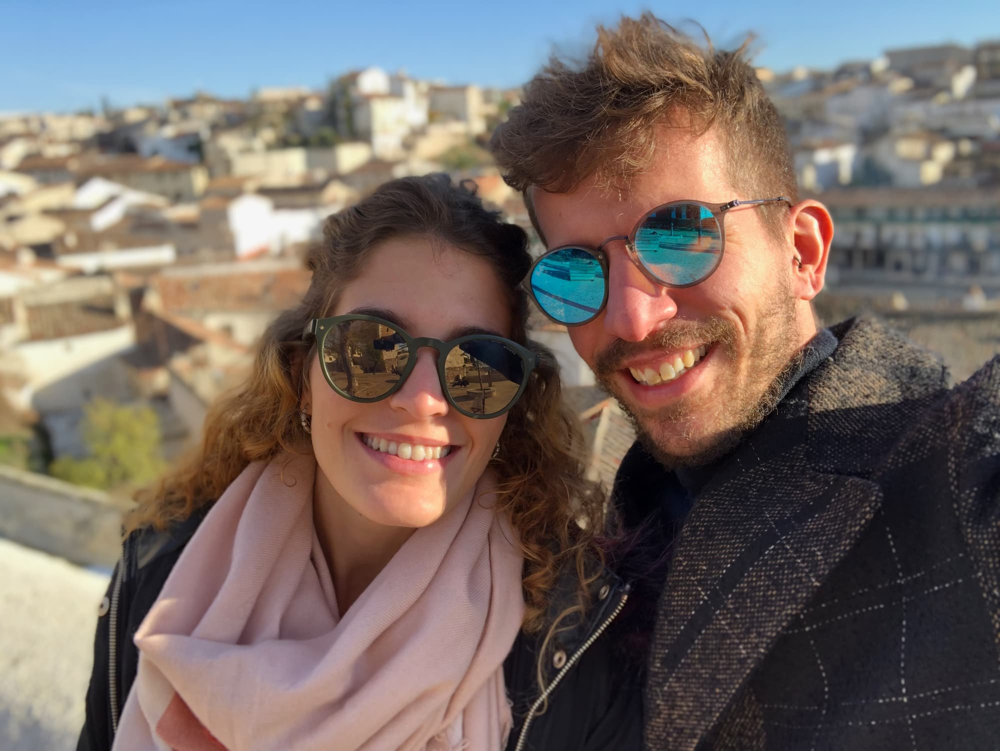

Y el año terminó yéndonos a Chinchón. Tu regalo de ese año fue una cata de vinos en este pueblo y allá que nos fuimos. Además, inauguramos la tradición de comprar un billete de lotería todos los años, porque soñar es gratis (bueno, 20 euros). A día de hoy todavía no nos ha tocado nada. Seguiremos intentándolo.

