Por fin tocaba coger un avión juntos. ¿Estaría evitando volar para que no te dieras cuenta de mi miedo a los aviones? 😜

Fue un viaje que me hacía mucha ilusión porque era el primero que organizábamos, aunque luego no guardemos tan buen recuerdo de los bazares, sus calles, las especias....

El primer día empezamos fuerte. Marrakech en la cara. ¡Pah! Esta foto es minutos antes de que nos viéramos rodeados de niños deseosos de llevarnos a "la plasa" y de paso quitarnos nuestros dineros. ¡Menudo mal rato!

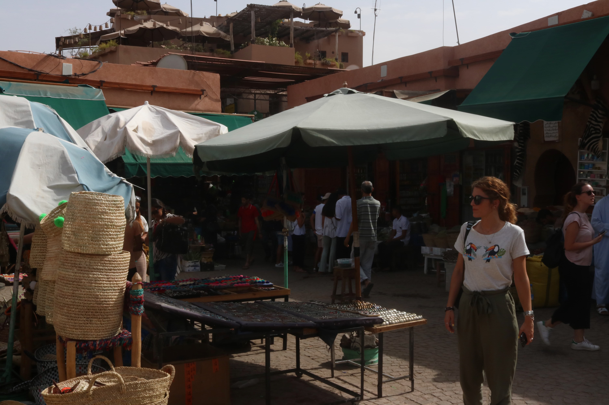

Pero al día siguiente ya le cogimos el truquillo y pudimos ver sitios muy molones, como el **Jardín Majorelle** que había a las afueras o el **Palacio de la Bahía**.

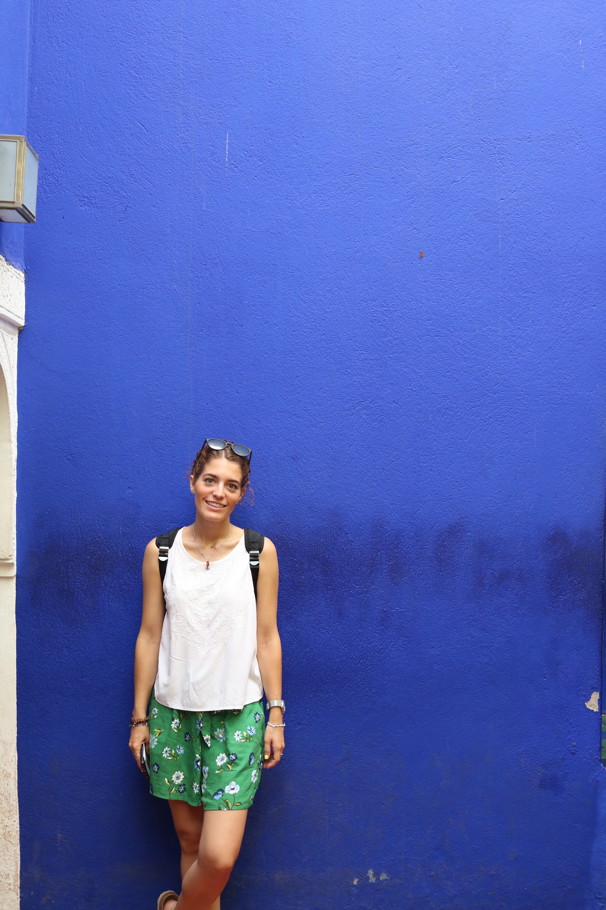

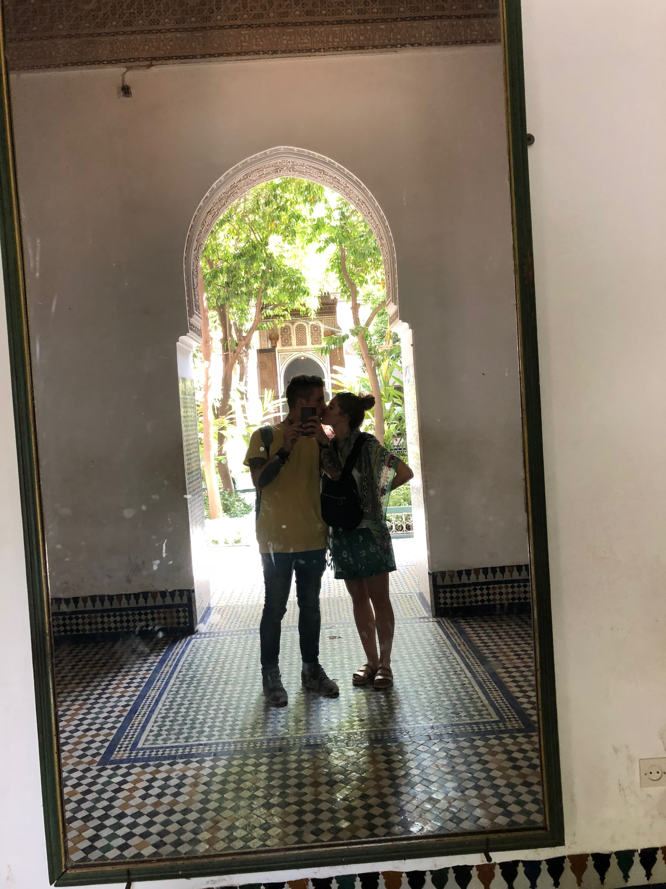

También fuimos a Essaouira con Civitatis, una excursión que moló muchísimo. También el guía, que no no se calló en todo el camino. Aquí la típica mujer trabajando en aceite de Argán todo el día:

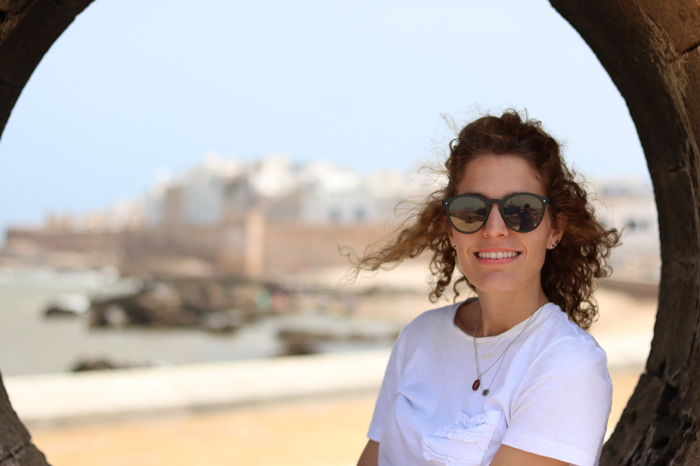

Y también los pichuflines buscando rincones para hacernos fotos muy molonas!!

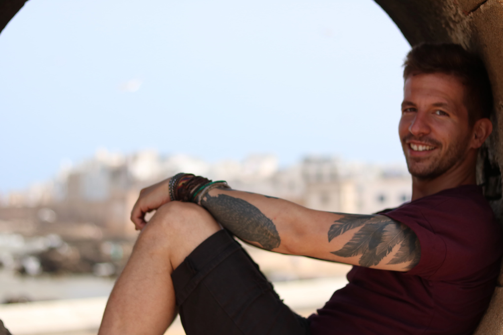

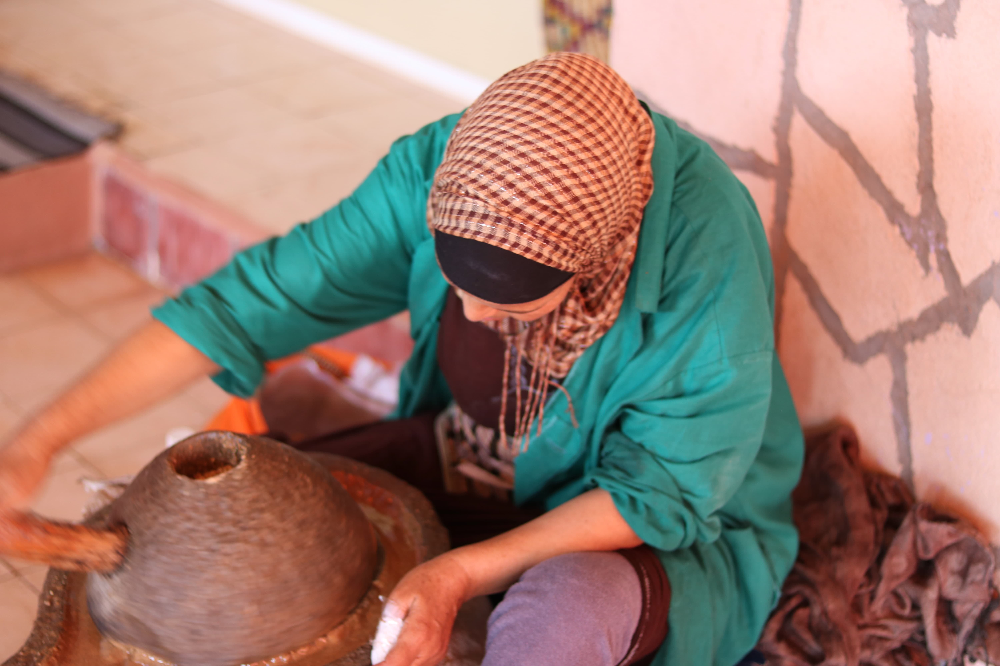

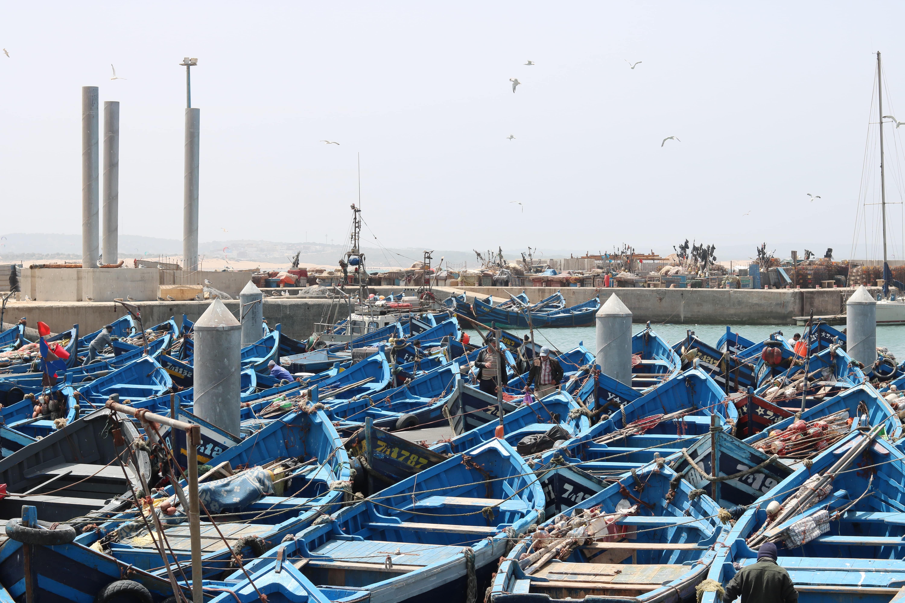

La segunda parte del viaje también moló, aunque nos endiñasen a una Colau a gastos pagados diciéndonos que era la novia del guía. ¡Menudo cabreo tenías! Jajaja. Me estoy riendo de sólo acordarme.

Estuvimos 3 días visitando el **desierto del Zágora** y el sur de Marrakech con un guía local que estaba un poco loco y se sentaba como los monitos.

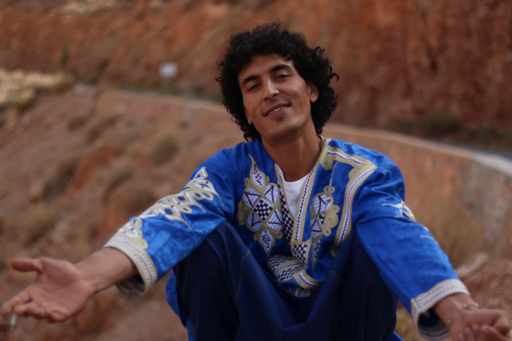

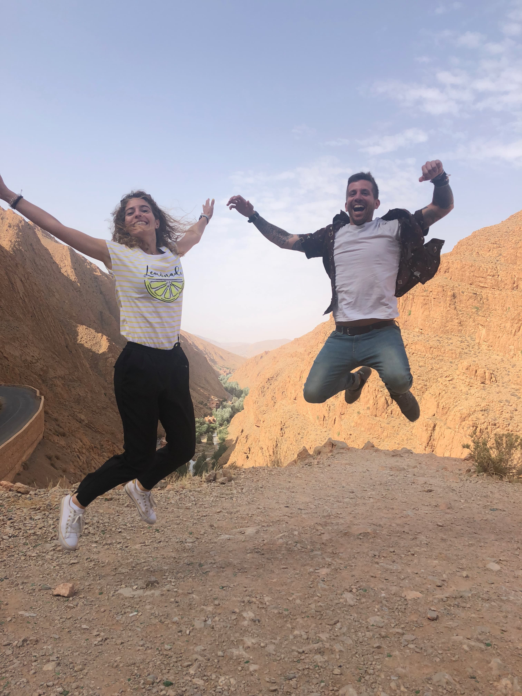

Además montamos en camello para recorrer el desierto. ¿Te acuerdas cuando te caíste? Yo sí.

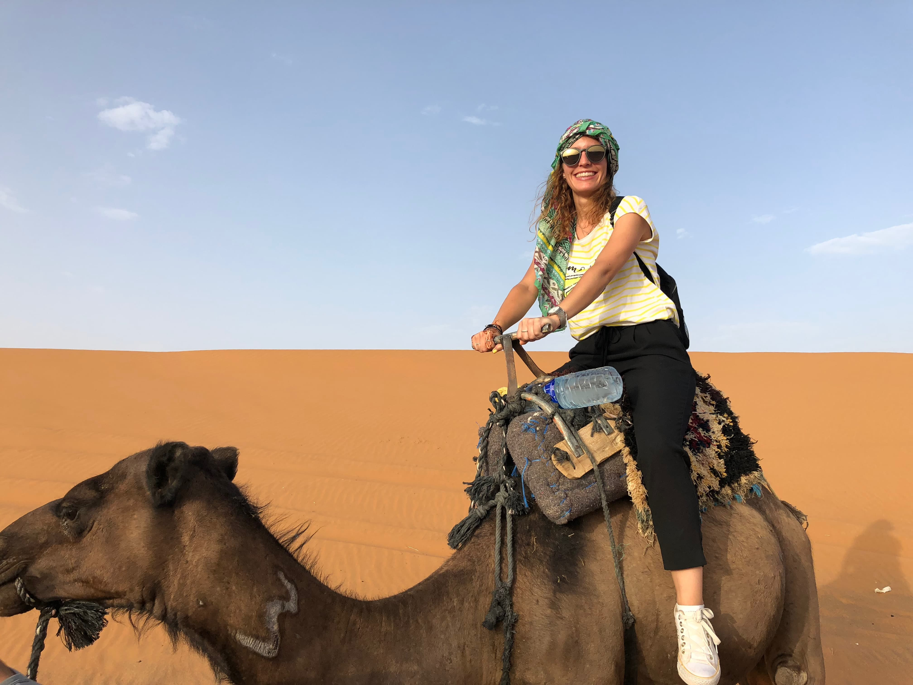

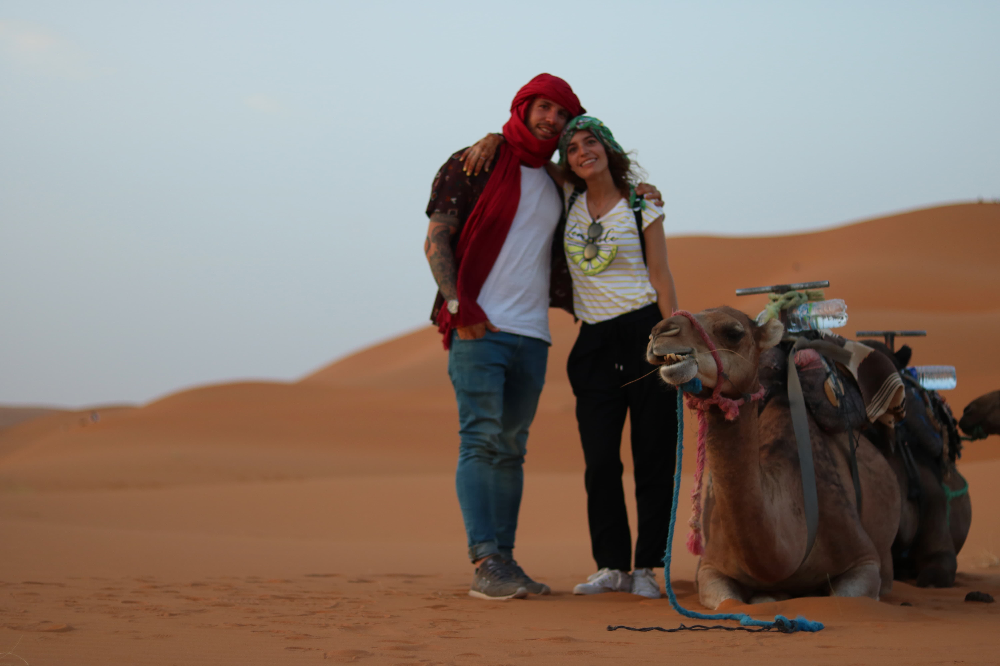

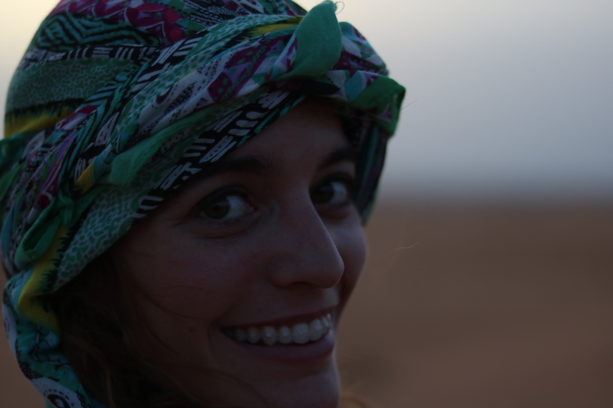

¿Te acuerdas del calor que hacía en las tiendas de campaña? Menuda sauna...

Después del Zágora fuimos a **Uarzazate** y un par de pueblitos más...

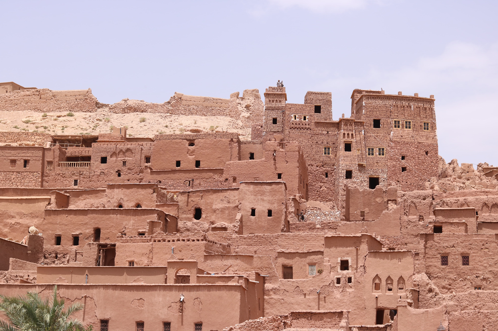

Hasta que llegó el día de volver a Marrakech y terminar nuestro primer viaje largo juntos.

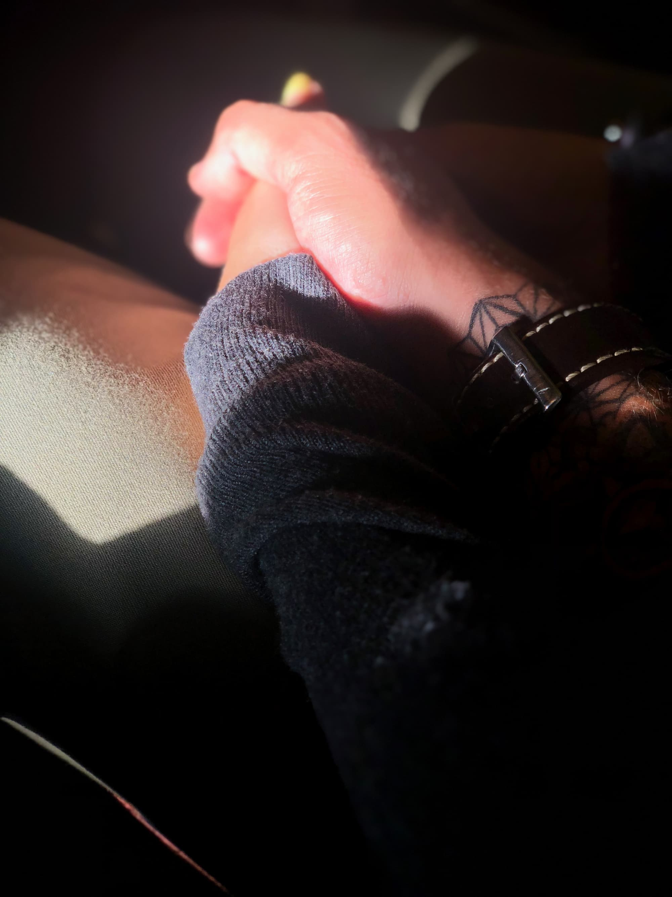
