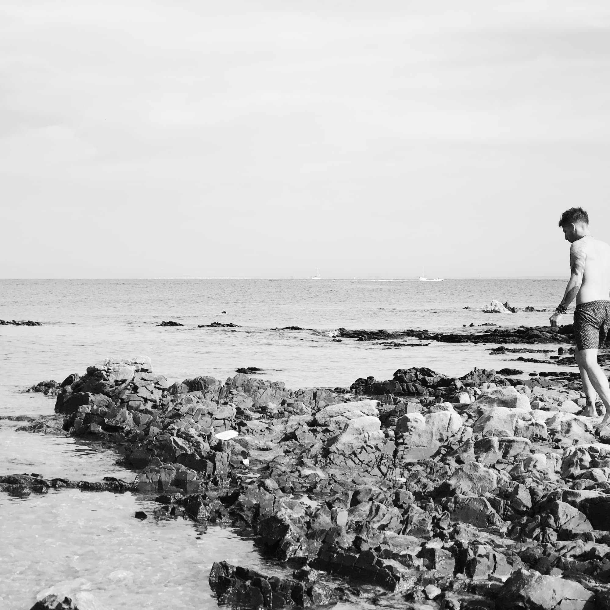
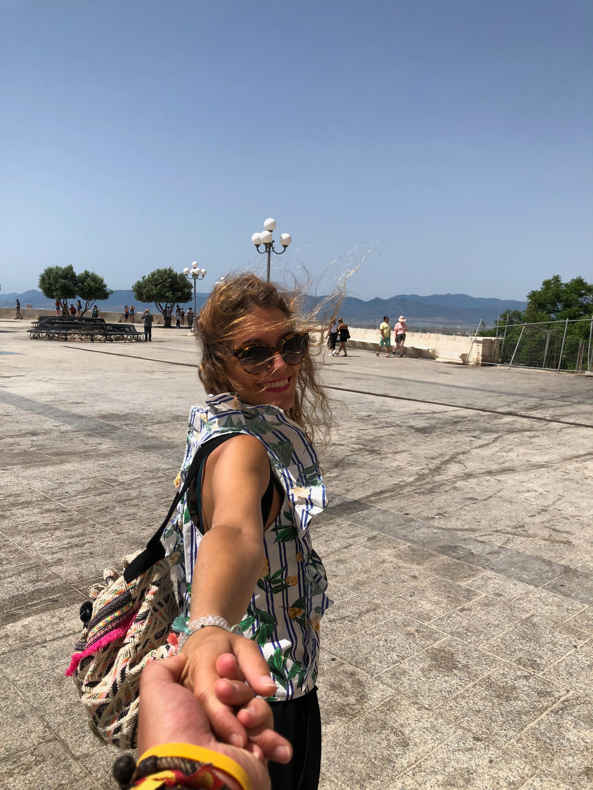

Ahhhh. Llegó el momento de "parlare italiano", poniendo rumbo a Cerdeña. Este fue nuestro segundo gran viaje.

Yo tenía muchas ganas de comer "piccsa", así que fue de las primesas cosas que hicimos al llegar a Alghero. Aunque primero tuvimos que aguantar una hora al "pesado de turno" para recoger el coche. ¡Que incompetentes por Dios!

Visitamos muchas playas, aunque mi favorita fue la de **Stintino**. Hicimos fotos muy muy molonas, tenemos que repetirlas en otros destinos.

También pudimos ver puestas de Sol increíbles, como esta en Alguero, que durante unos días fue nuestro campamento base.

También descubrimos calitas donde tumbarnos a descansar y relajar esa cabeza tan ajetreada que tenemos a veces.

Y, cómo no, hubo también momento helado (música de circo):

En nuestro recorrido por la isla descubrimos pueblos preciosos como **San Pantaleo**:

Y te obligué una y otra vez a repetir la misma foto hasta que quedó bien. El exigente.

En **Olbia** me hice el valiente en la noria:

Y terminamos nuestra aventura en Oristán, en un Airbnb precioso. ¿Te acuerdas?

PD. Cuando parecía que el viaje terminaba aún quedaba una aventura más. El avión. Menudo rato pasé cuando subió el mecánimo con esa carpeta que no presagiaba nada bueno. Este pichuflín... Menos mal que estabas ahí para darme la mano y sonreír como siempre.

