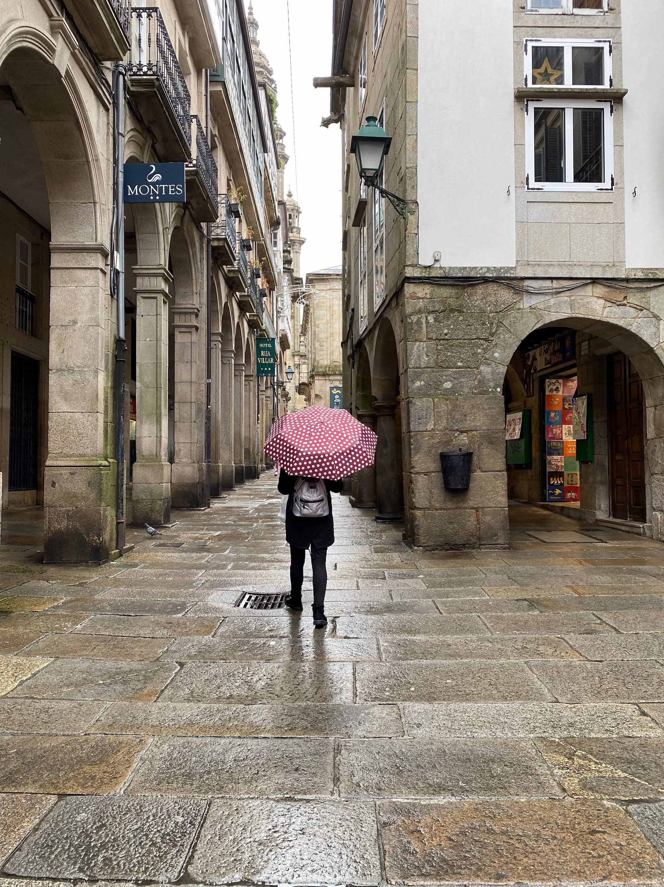

Nuestra última escapada fue a Galicia. Todavía no sabíamos la que se nos venía encima jejeje. El viaje de ida fue súper cansado, creo que tardamos más de 7 horas en llegar. Pero al final, como siempre, lo logramos.

Primero fuimos a **La Coruña**, donde tratamos de comer un buen pulpo pero no fue posible. ¿Explicación? Ninguna...

Como era Navidad pudimos ver las luces en todas las ciudades y pueblos a los que fuimos:

Las de esta foto son las de **Betanzos**. Creo que no hace falta explicar por qué terminamos ahí:

Desde entonces incorporé este tipo de tortilla a mis recetas y cada vez me salen mejor.

También fuimos a **Marín**, un pueblo donde Marta nos había recomendado un restaurante para comer marisco. Pero antes, además de nuestra foto típico, también posé como modelo para sacarme esa foto que tanto me gusta haciéndome el interesante.

Nuestra ruta por Galicia la terminamos en **Santiago**, donde recibiste la mala noticia de que en Cerdeña nos habían puesto una multa. Nada que un "pollo cabreado" no pueda resolver. Si mi memoria no me falla, llevabas este paraguas en el momento en que recibiste el mensaje:

Allí vimos más lucecitas:

Compramos nuestro billete de lotería de rigor, que como siempre, no tóco (normal, con ese número...)

Y terminamos entrando en una farmacia para que nos dieran algo para mi tripita. Sí, estoy hablando del momento supositorio y la risa que pasamos mientras nos atendían.

