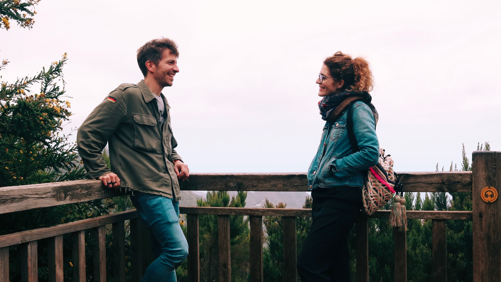
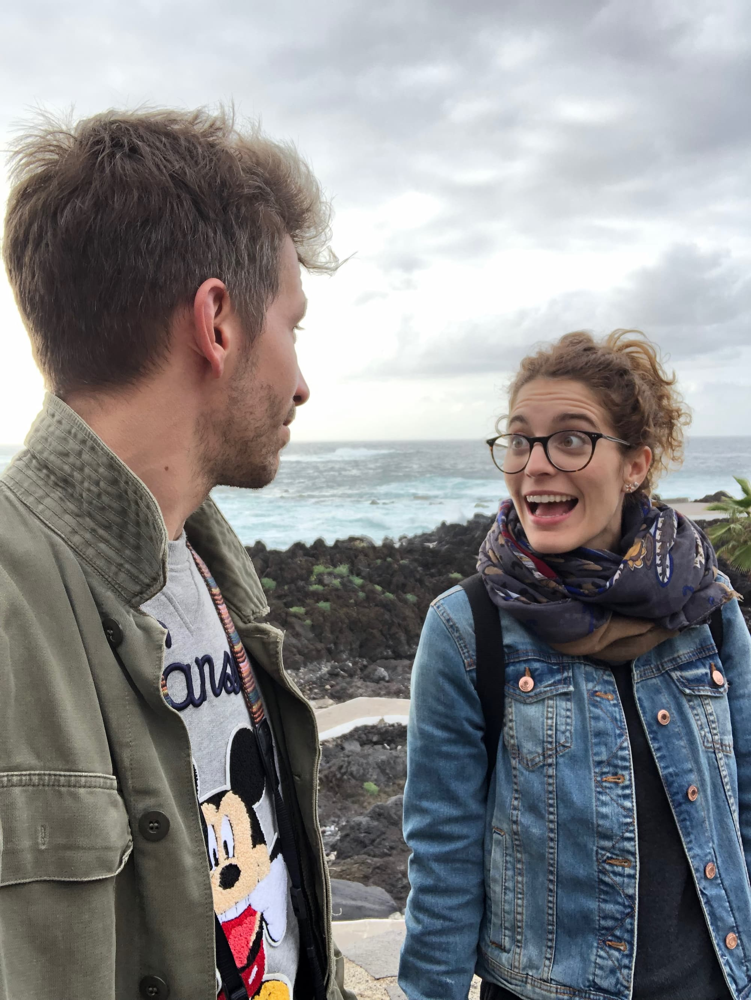
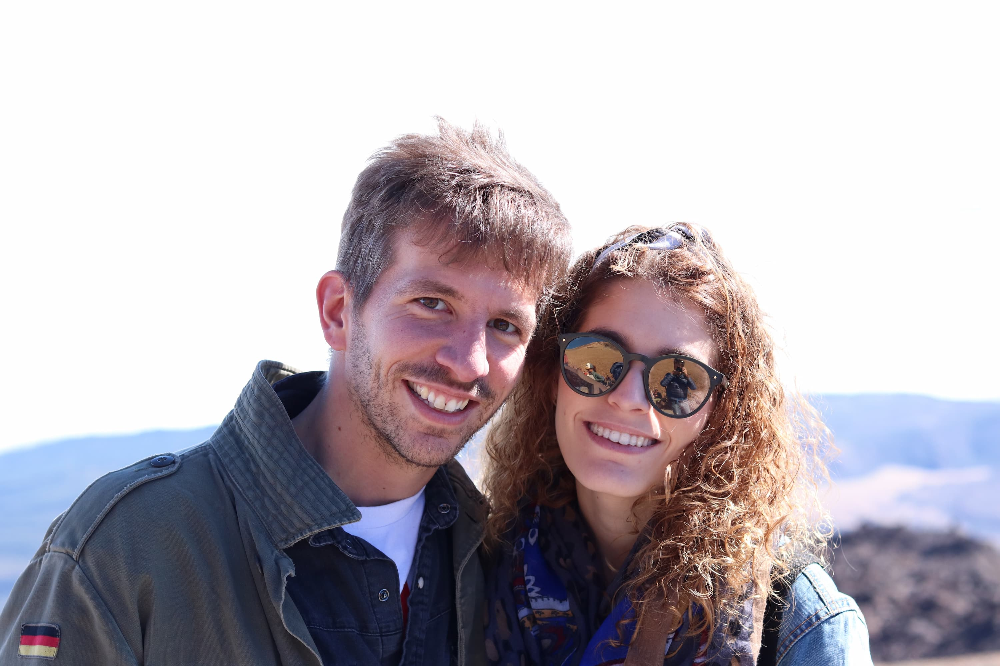
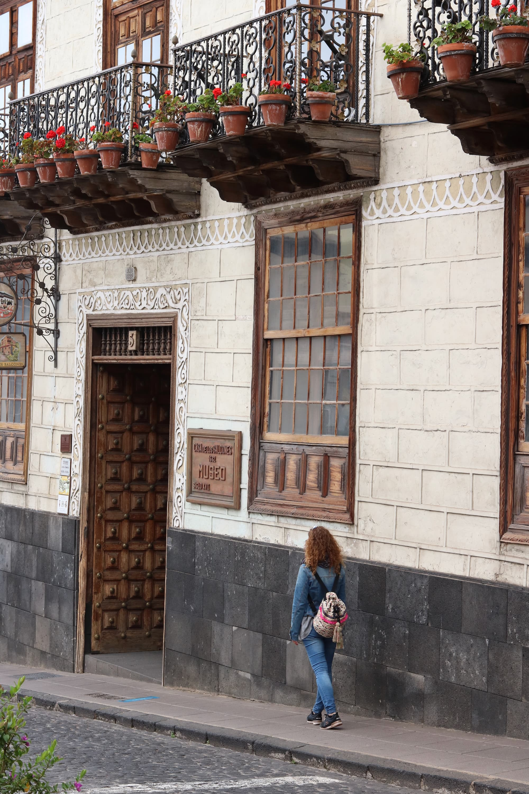
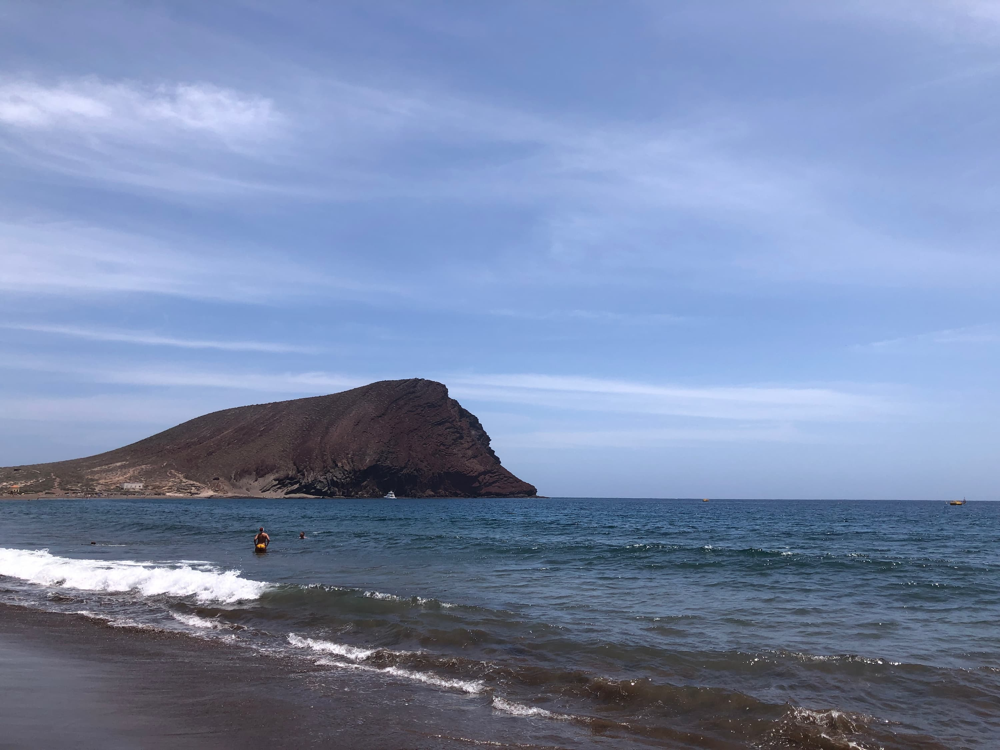
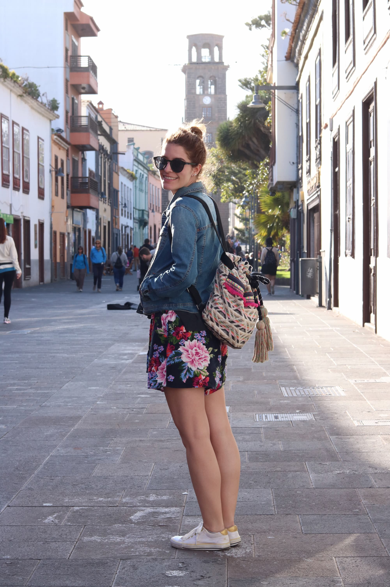
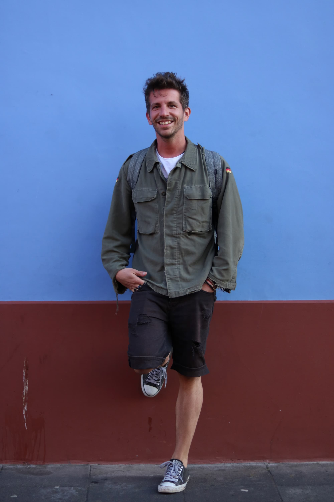

"Si te toca al final de mesa electoral, yo me voy eh!". Había ganas de vacaciones ese abril. Pero por suerte el recurso pasó y pudimos ir juntos hacia nuestro nuevo destino: Tenerife.

Primero fuimos al norte, al **Parque de Anaga**, donde nos hicimos una de las fotos más bonitas que tenemos juntos:

E inauguramos nuestra tradición de hacernos fotos mirándonos:

Por supuesto, fuimos al **Teide**, aunque estaba llenísimo de gente. No se por qué, pero en esas fotos parecía un señor de 40; las canas empezaban a hacer su aparición.

Y antes de viajar hacia el sur, te obligué a pasar 10 veces debajo de un balcón hasta conseguir la foto perfecta. También es verdad que no había nada mejor que hacer, porque a las 3 ya no dan de comer en Tenerife, "British schedule" lo llaman.

De nuestros 3 días en el hotel del sur de la isla no hay apenas fotos. Los pasamos comiendo en el bufet libre y tirados en la playa.

Eso sí, pude demostrarte mi amor nadando hasta la boya como Thor.

El último día fuimos a **San Cristobal de la Laguna**, nos comimos un helado y nos hicimos fotos tan chulas como estas:

Fue, como todos, un viaje perfecto.
