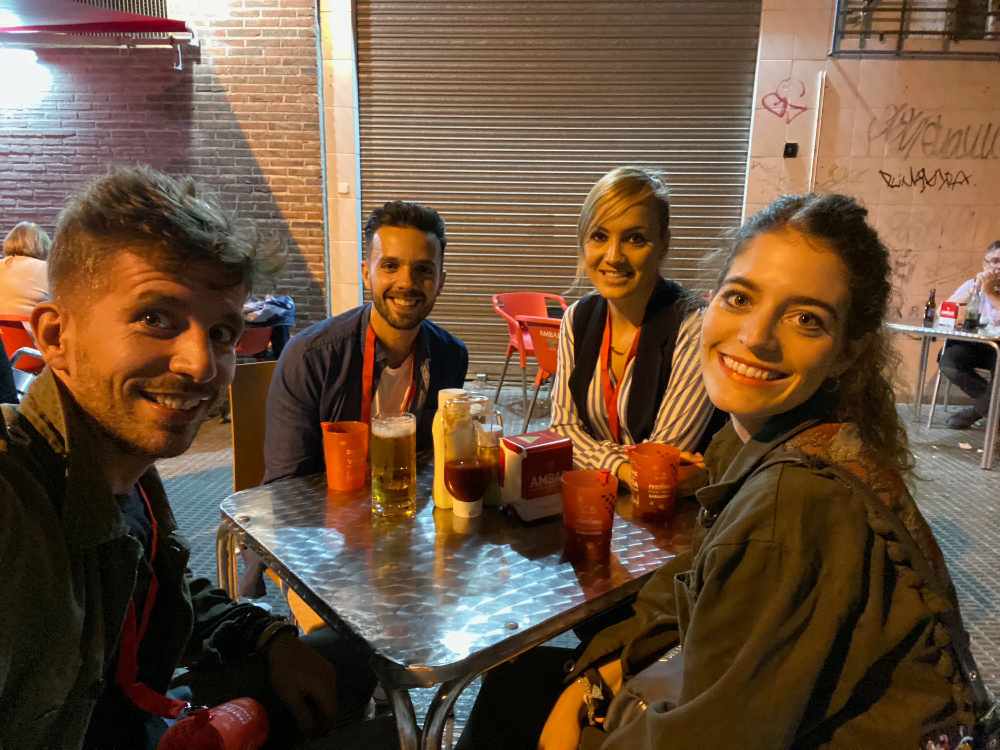
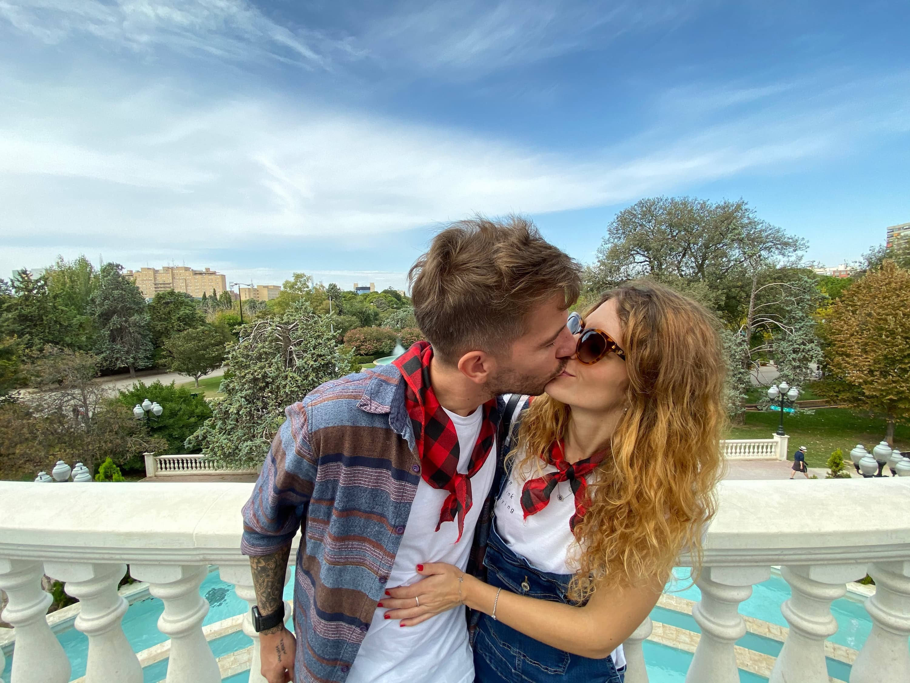
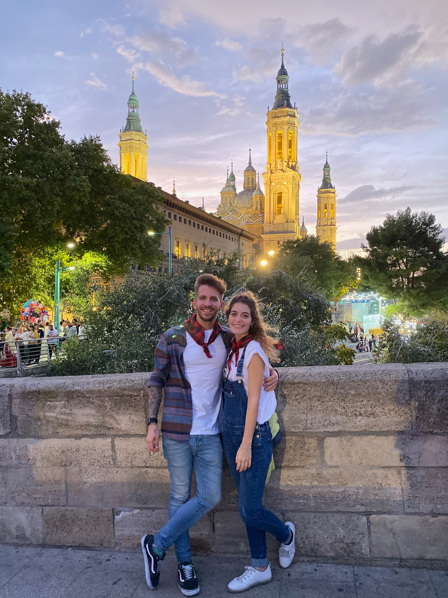
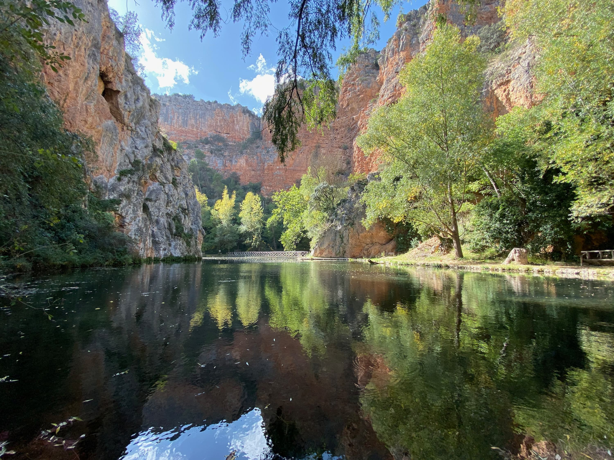

En octubre tocó, por fin, viajar con Dani y Vero. ¿Destino? Las fiestas de "El Pilar" en Zaragoza. Fue un viaje muy divertido. También fotográfico. Recuerdo que no querías más fotos y cuando me paraba me mirabas con tu cara de... ¿pero otra foto más?

Cuando llegamos a la plaza me acuerdo que empezó a sonar la canción de "son tus pechos cántaros de miel..." y Vero se indignó mucho diciendo: "menudo respeto".

Al día siguiente fuimos de excursión al "Monasterio de Piedra", ese tipo de lugares que a ti te encantan con sus paisajes y sus cascadas. Seguro que en España hay muchos más rincones como este para que los sigamos visitando.

