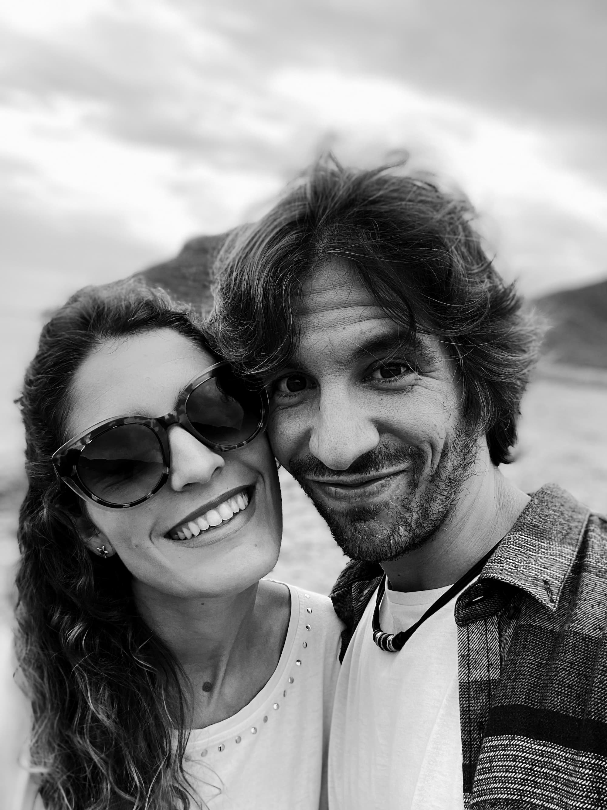
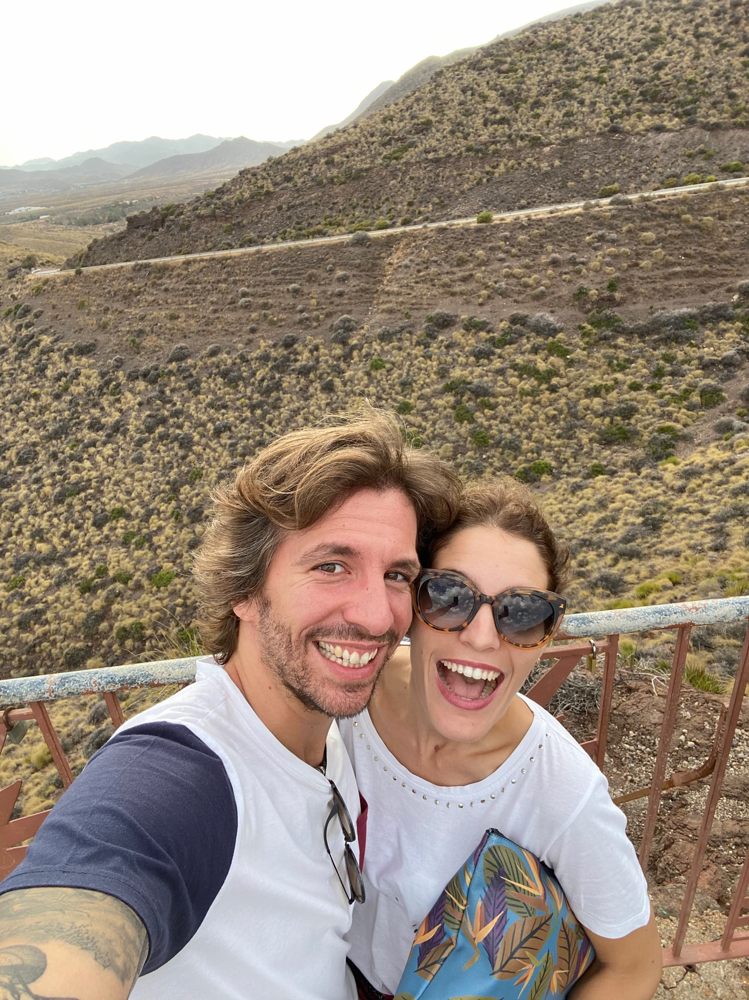
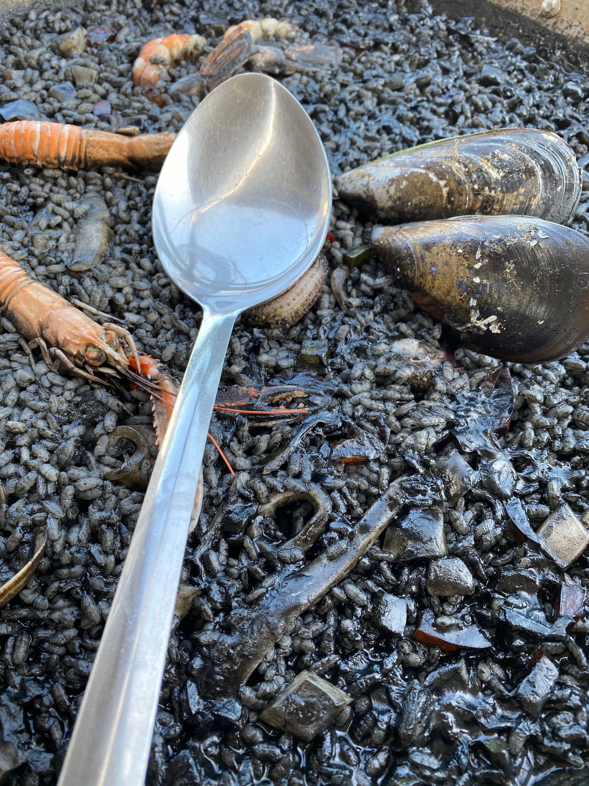
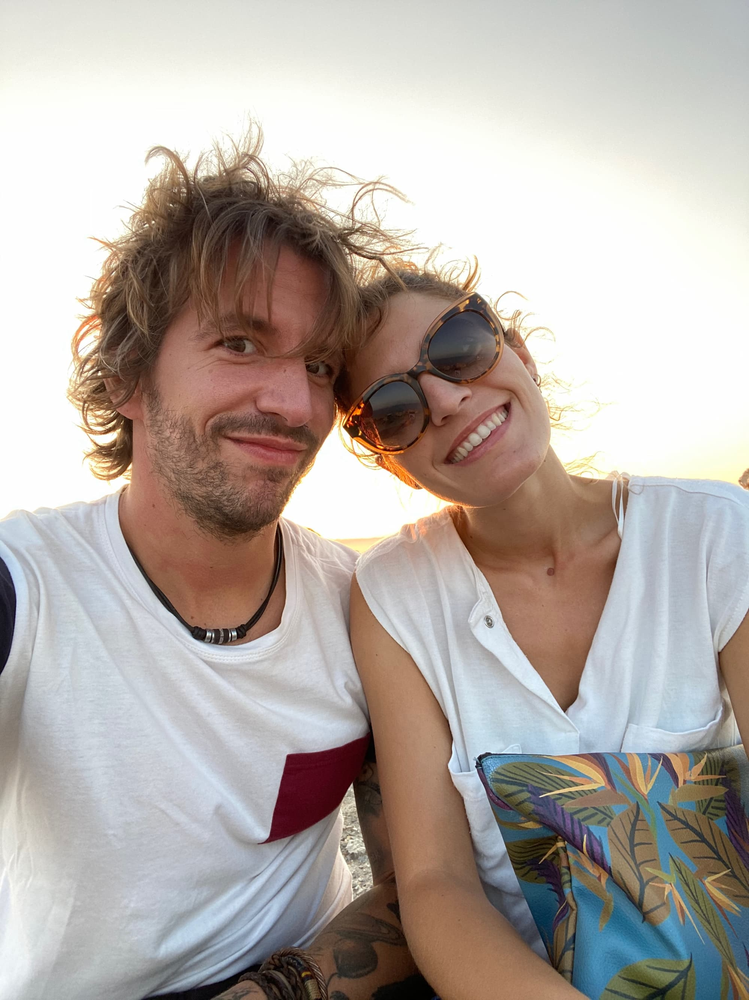

El último viaje que hicimos ese año fue a Almería. El horno no estaba para bollos y al volver empezó eso que llamaban "la segunda ola". Hoy, verano de 2022, vamos por la "séptima".

Teníamos muchas ganas de viajar, de ver la playa y sobre todo, de estar tranquilos, alejados de videollamadas y de esa rutina tan rara que el coronavirus había impuesto.

En Almería hicimos una ruta por distintas playas. Fuimos al **Playazo de Rodalquilar**:

Estuvimos en el **Parque Natural de Cabo de Gata** (donde el viento comenzaba a agitar mi incipiente melena):

Y comimos cosas la mar de ricas, como este arroz negro en Níjar:

Por cierto, ¿fue aquí cuando me empeñé en subir a lo alto de un edificio en ruinas para hacerme una foto y luego me dio miedo? Diría que esta foto es justo de ese momento.

