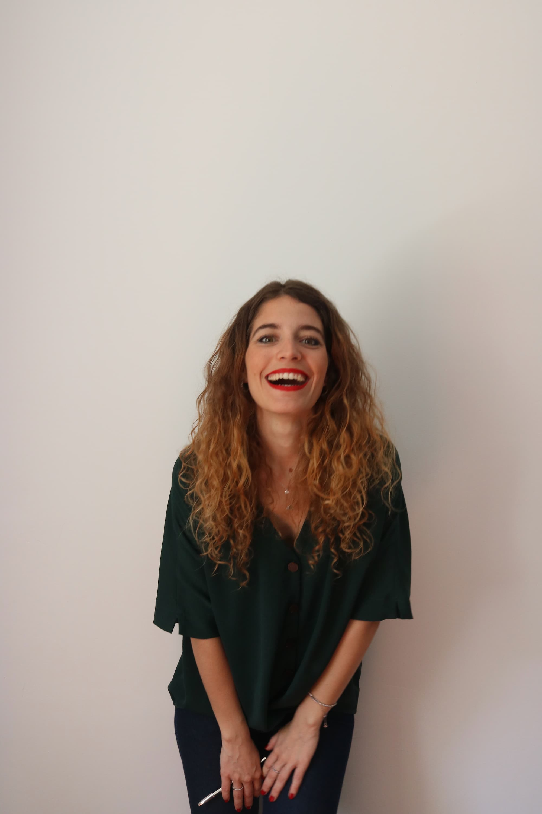
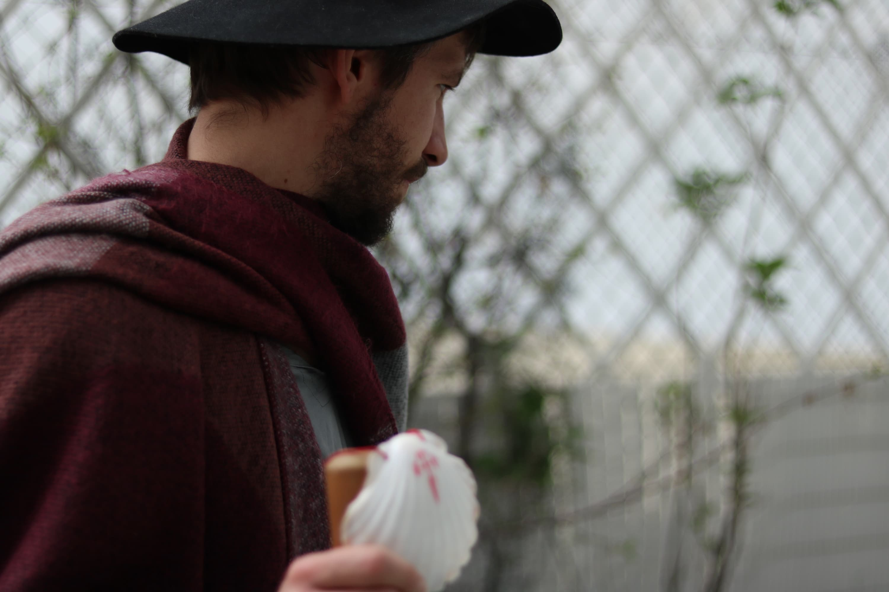
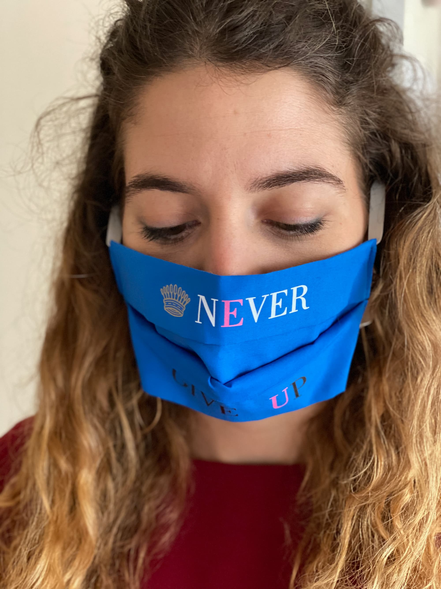
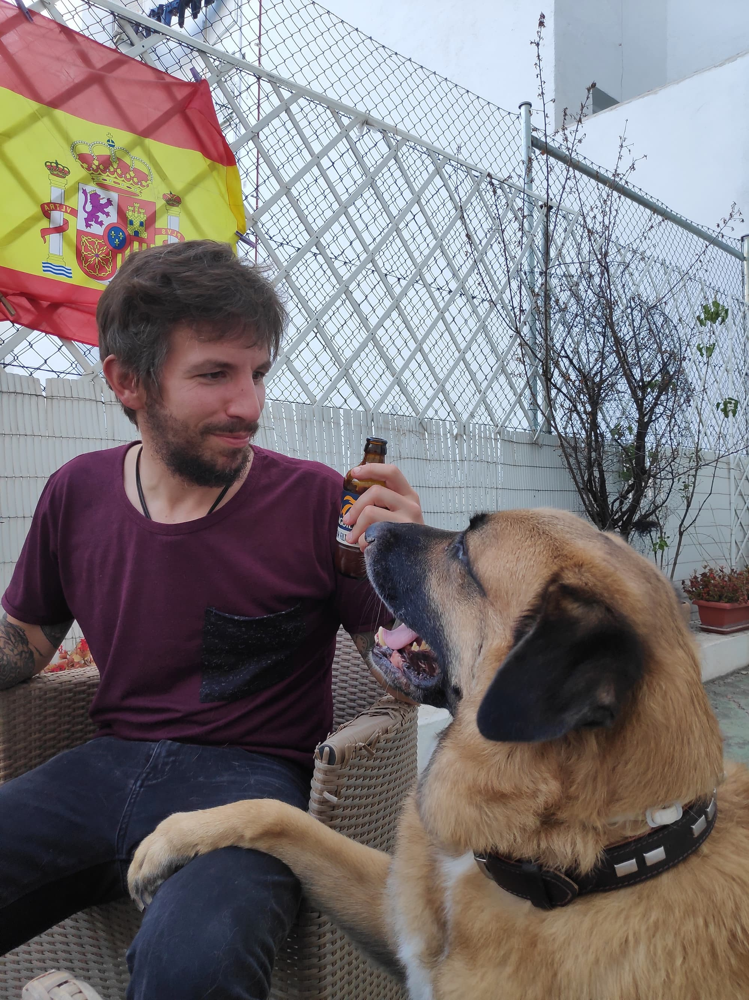
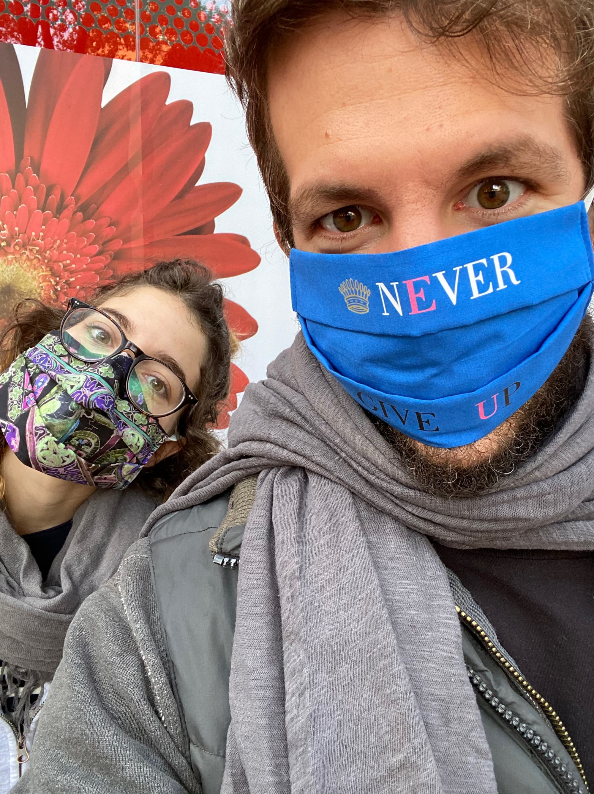
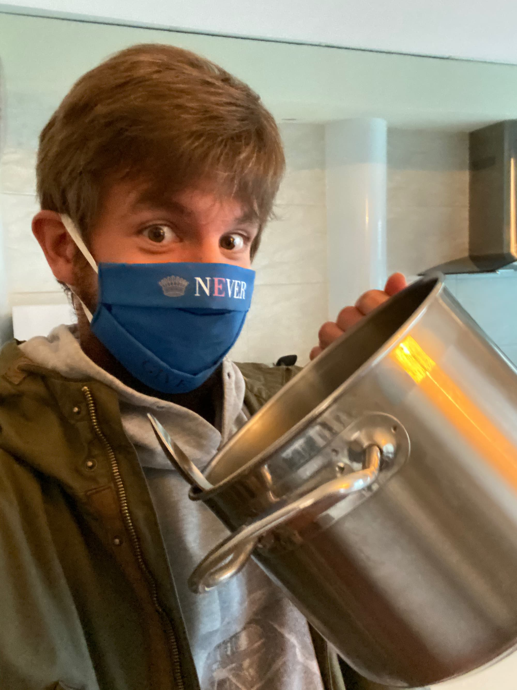
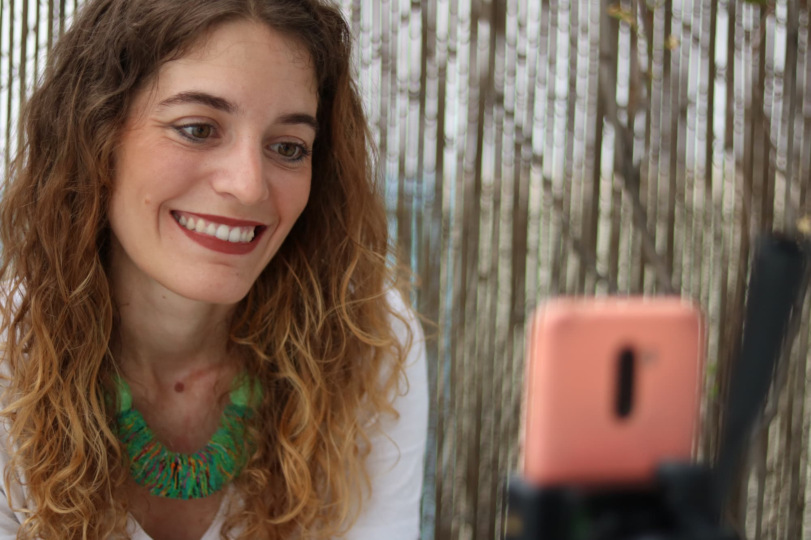

Vietnam... ¡las narices! ¡Pandemia mundial! 😷 Menuda aventurita vivimos, pero lo más importante fue que la vivimos juntos. ¿Te acuerdas ese viernes cuando ya era un hecho que nos iban a encerrar y fuimos corriendo a por tabaco? Ese sábado apareció Sánchessss y dijo lo que todos esperábamos: que nos confinaban en casa 15 días. Esos 15 días al final fueron casi 2 meses, pero nos dio la oportunidad de vivir juntos y ¡vaya que si la aprovechamos!

Nos hicimos unas cuantas sesiones de fotos para nuestros proyectos:

Hicimos como que viajábamos disfrazados:

Nos compramos mascarillas molonas para ver si así me convencías de llevarlas:

Descubriste lo divertido que es vivir con un "lechoncito":

Y empecé mi cambio de look: pelo largo y una barba "muy graaaande":

El **2 de mayo** por fin nos dejaron salir de casa. "Fase 0" lo llamaban:

Había llegado la primavera. Y con ella las caceroladas a "Chanche":

Y las temidas avispas!!!!

Te lo diré siempre, admiro la forma en que te sobrepusiste a la situación. Tú solita y sin ayuda de nadie te armaste de valor y tiraste para delante. Empezaste a participar en directos, le diste "caña" a tus redes sociales y poco a poco conseguiste remontar la situación. ¡Eres la mejor sin dudarlo!

Para cuando llegó junio ya habíamos comenzado a crear un pequeño hogar. La casa era más luminosa, tenía esa clase de detalles que sólo tú puedes dar a la vida y nuestra terraza se llenó de flores y color.
