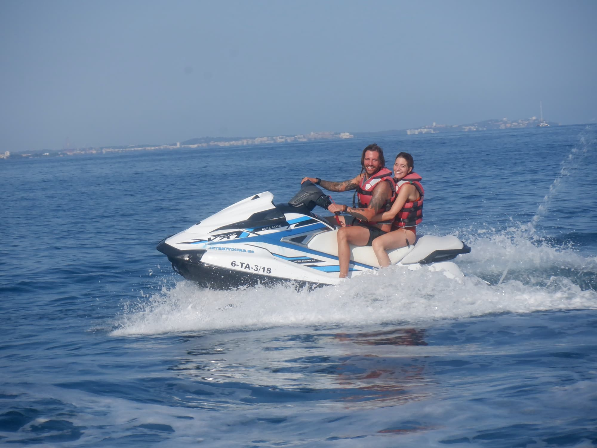

A la vuelta de Menorca todavía quedaban muchos planes. Entre ellos, el viaje de rigor por tu cumple a Cambrils. Volvimos a quedarnos en el apartamento de tu padre, pero esta vez con bicicletas para ir y volver al pueblo.

Hicimos una excursión con Josu y Ari a **Cala Jovera** para comer, jugar a la palas y comer un heladito en una heladería muy famosa.

A la vuelta, cenamos con ellos en casa de Ari (me puse morado!!!) y nos quedamos a dormir, ¡un plan redondo! Tan redondo como la cerveza que se me olvidó en el congelador de los padres de Ari jajaja.

También comimos y cenamos varias veces con papi. Una de ellas con susto incluido cuando me olvidé la gorra en el restaurante. Menos mal que abundancia acudió al rescate y pude recuperarla.

Pero lo mejor, mejor, mejor de esos día fue cumplir mi sueño de conducir una moto de agua. ¡Gracias mi pichuflina!

Pd. Si vuelvo a coger una moto de agua tengo que acordarme de protegerme bien los huevitos, ¡que dolor!

Pd2. Esta tarde quedamos con Clara y María Angrill y creo que de ahí salió esa frase que tanto decimos desde entonces... ¡que graaaaaaaandee!
