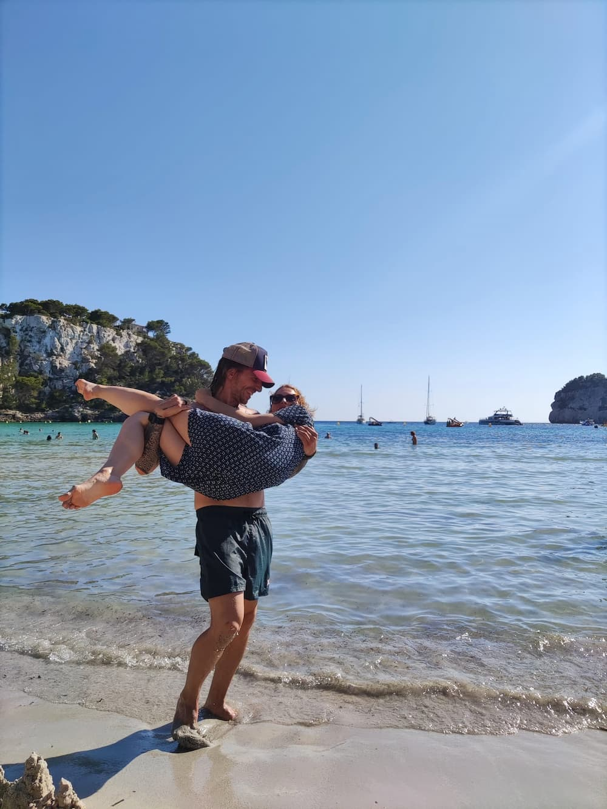
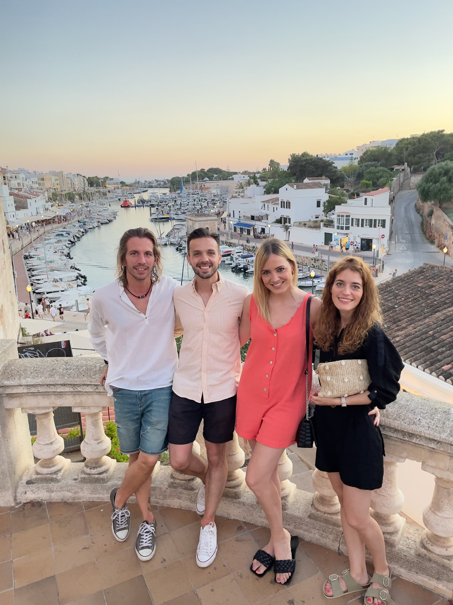
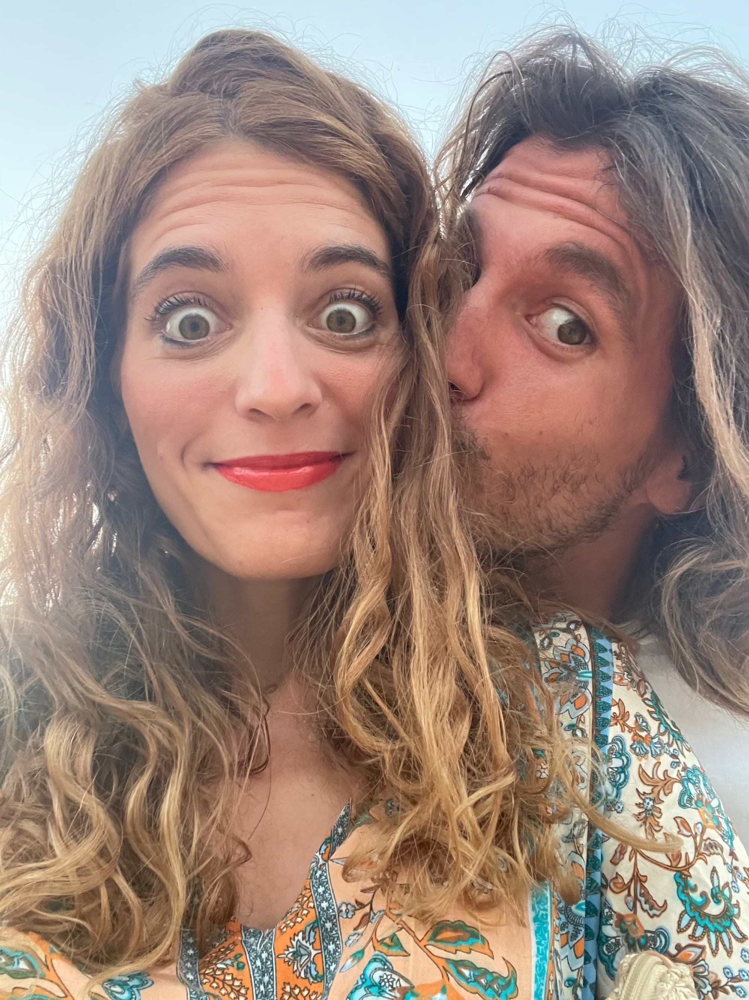
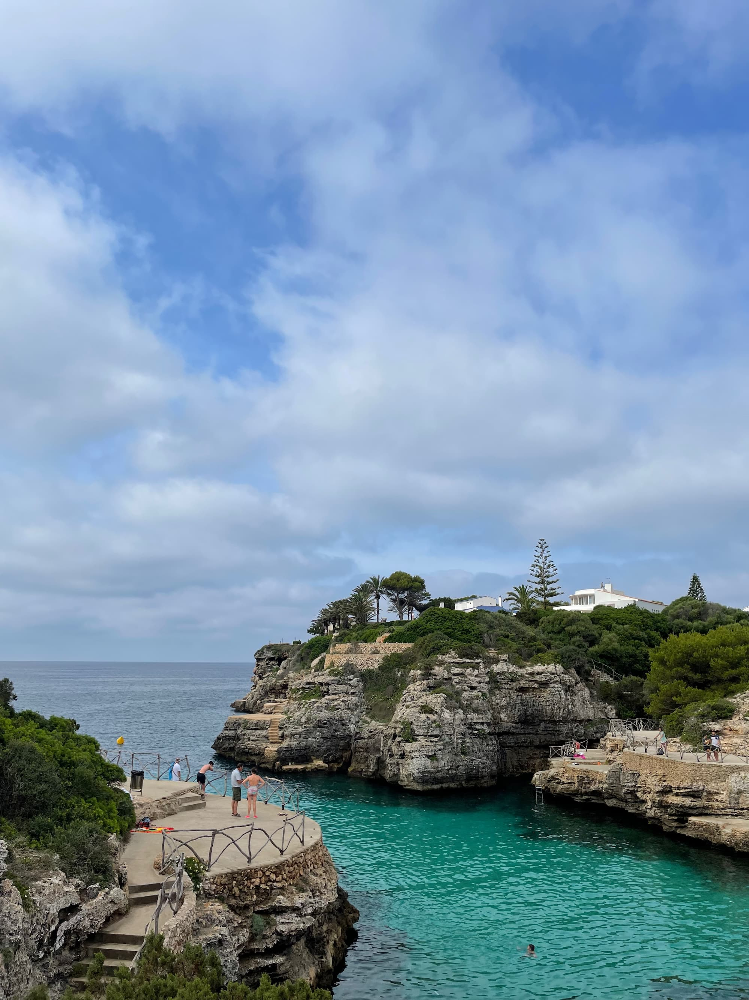
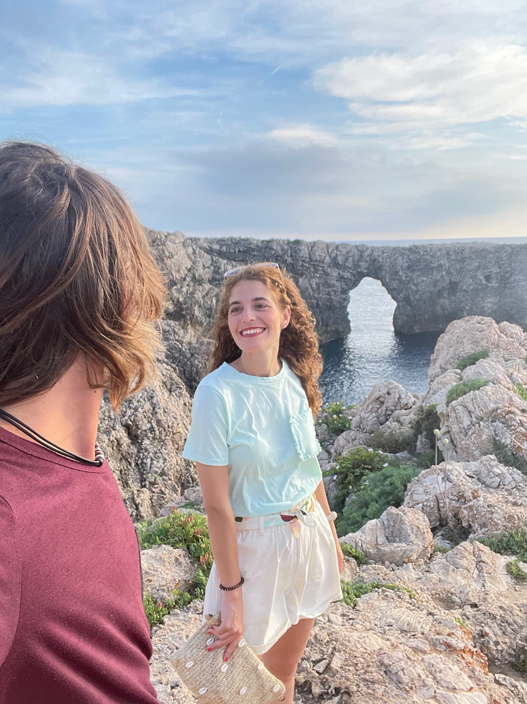
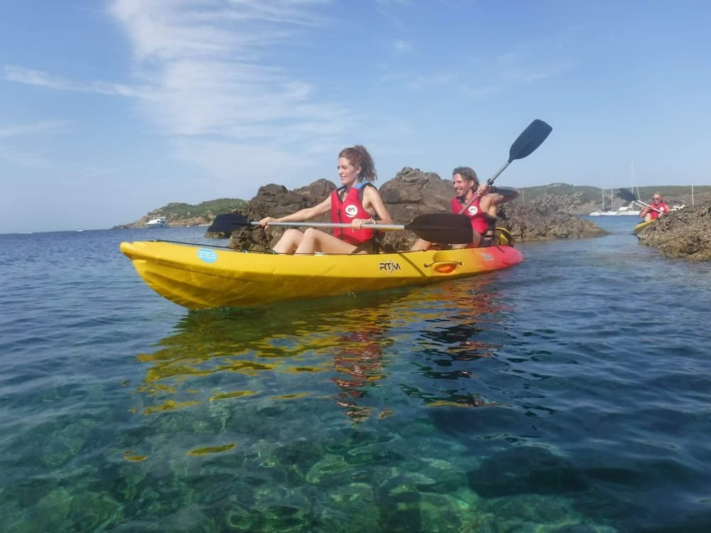

Y, al fin, llegó el momento de volver a subirnos en un avión. Destino: Menorca. Acompañantes: Dani y Vero. La verdad es que ya había ganas de volar y pasar unos días relajados disfrutando del Sol y la playa.

Allí habíamos alquilar un coche para poder recorrer la isla. Lo que no sabíamos es que íbamos a empezar el viaje con un pequeño problemita: me había dejado el carnet de conducir en casa porque, moderno yo, pensaba que con el digital valía. Tuvimos que discutir, y discutir, y discutir más con la empresa para conseguir que nos dieran un coche. Al final la broma salió carísima y yo me sentí muy mal durante todo ese día. Menos mal que luego se me fue pasando.

En este viaje visitamos muchos sitios, playas y restaurantes. Fuimos a **Cala Galda**:

Cenamos en Ciudadela varios días, donde aproveché para saciar mis caprichos comprándome unas sandalias menorquinas:

Y nos pusimos guapos para cenar en un restaurante muy molón llamado **Isabella**:

En **Blanes** volví a luchar contra mi vértigo una vez más, esta vez lánzandome al agua desde un acantilado.

Cómo no, nos hicimos nuestra foto típica de viaje, esta vez en una calita que quedaba cerca de dónde íbamos a intentar cenar mientras veíamos la puesta de Sol. Craso error. La cola era tan "graaaaaande" que tuvimos que abortar misión e irnos a otro sitio.

Aunque lo mejor del viaje fue, sin duda, volver a practicar nuestra sincronización dentro de una barca. En la foto se puede apreciar lo bien que llevamos el ritmo remando en la piragua:

