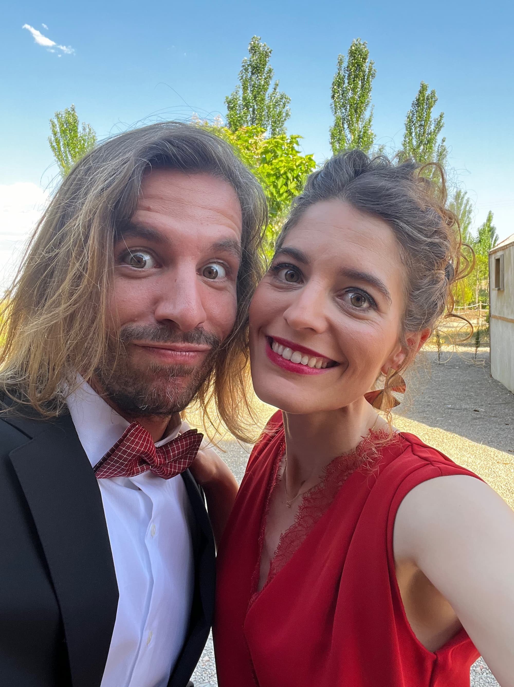
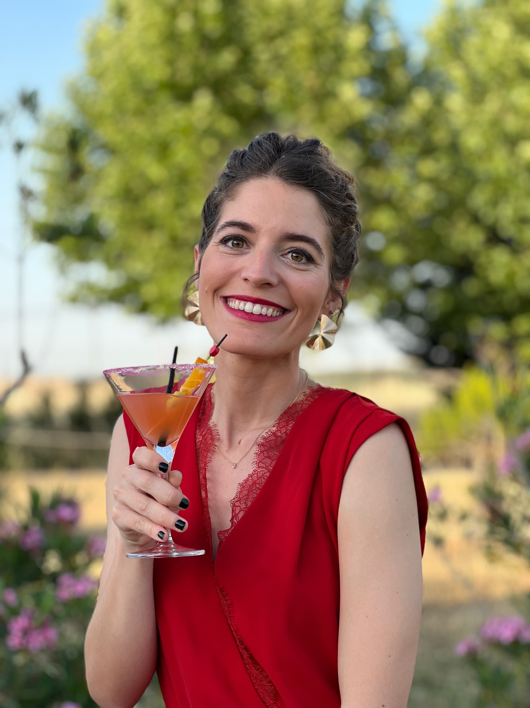

Entre medias de las despedidas de Fran y Dani tuvimos la boda de Irene y Juan. Era en Ciudad Real y hacía un calor de muerte. Además tu venías de Extraordinaria, por lo que descansada, lo que se dice descansada, no llegaste.

El viaje de ida fue súper interesante, porque tenías mil cosas que contarme de esos días que habías pasado en Barcelona. Cotilleos de los que a mí me gustan.

La boda fue aún mejor. La ceremonia fue cortita (el calor no invitaba a más) y nos pusieron en la misma mesa que Alba, Carol, Cris y Vicen, por lo que estuvimos haciendo el idiota todo el rato. Tú, por cierto, estabas preciosa con el mono rojo, aunque ibas un poco asustada porque te queda algo ajustado.

Bailamos todas las canciones que pusieron hasta las 5 de la mañana, momento en el que caímos en la cuenta de que había que dejar la habitación a las 11. Pese a mis ruegos de "una más", nos fuimos a dormir. Lo más sensato, teniendo en cuenta que al día siguiente tuvimos comida (migas) y apenas habíamos dormido.

Del viaje de vuelta en coche mejor ni hablamos. Una experiencia estupenda. Pero mereció la pena. Flying freeeee, pipipi pi pi.
