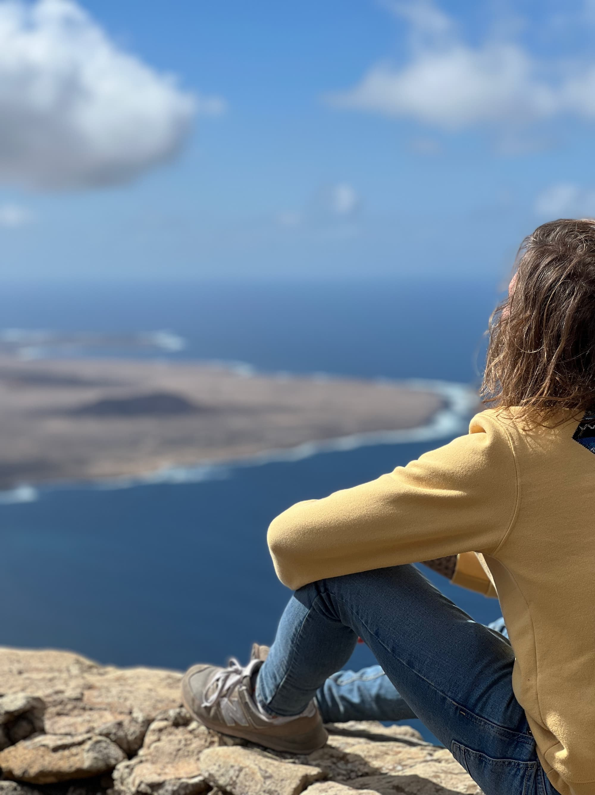
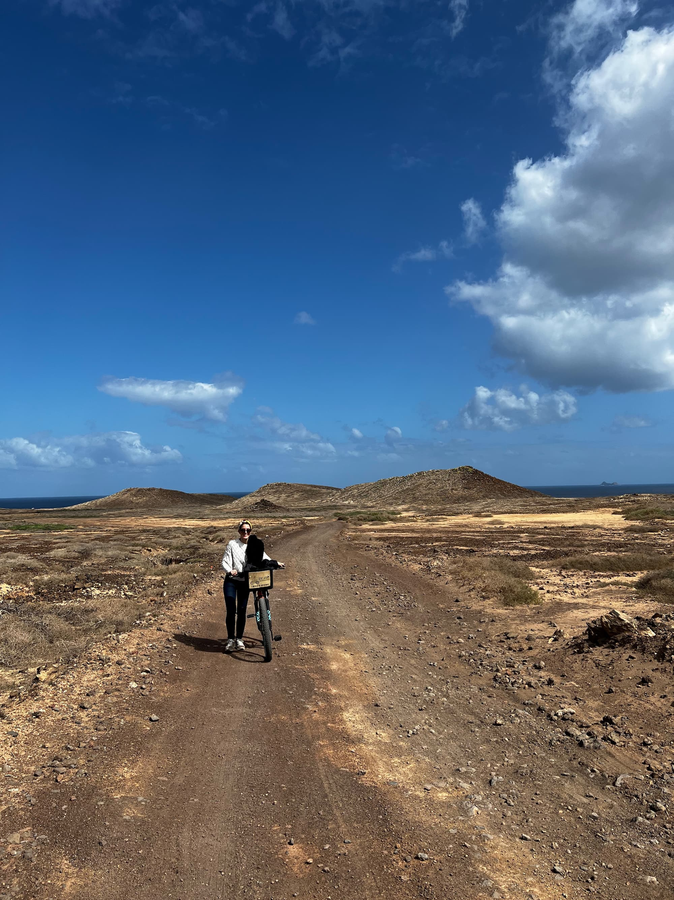

¡A por otra isla! Esta vez tocaba Lanzarote, de la cual nos habían hablado muy bien. Aprovechando que era febrero dijimos, ¿por qué no un poco de Sol, playas y buen tiempo? jejeje.

Así que allá que nos fuimos. El primer día fue un poco paliza: salimos a las 3, llegamos, cogimos el coche (nada que ver con Cerdeña, esta vez fueron la eficiencia hecha empresa, como a ti te gusta) y nos fuimos a visitar el **Museo Lagomar**.

Es un sitio precioso, lleno de rinconcitos con plantas y agua como a ti te gusta. La fuente para nuestro hogar se acerca un poco más cada vez que visitamos sitios de estos.

Dormimos cerca de Teguise, en una habitación que no tenía calefacción. "A ver, es Lanzarote", nos dijimos. ¡Error! Si ya habíamos pasado frío cenando la hamburguesa en el único restaurante abierto, lo de de esa noche no fue ni medio normal. Sol y buen tiempo, jejeje.

Pero bueno, nada frena a los pichuflines, así que pusimos buena cara como siempre, cogimos fuerza con el bocadillo más rico del mundo mundial histórico universal y nos fuimos a ver sitios bonitos.

Y a tirar fotos tan increíbles como esta, en la **Playa Femara**.

El mejor momento de Lanzarote lo vivimos en la isla de **La Graciosa**. Nos animamos a hacer la rutita en bicicleta y por poco me quedo sin pollito. ¡Cómo te indignaste!

Aunque nos cayeron unos cuantos chaparrones, supongo que los típicos con los que se encuentra todo el mundo que va a Lanzarote, fue un viaje perfecto para romper con la rutina. Necesitamos hacer más de estos.
